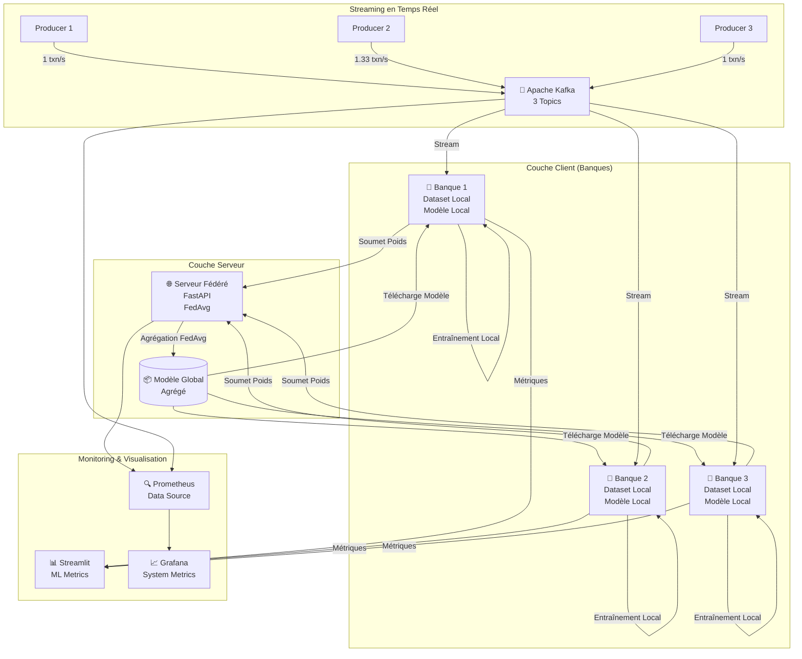
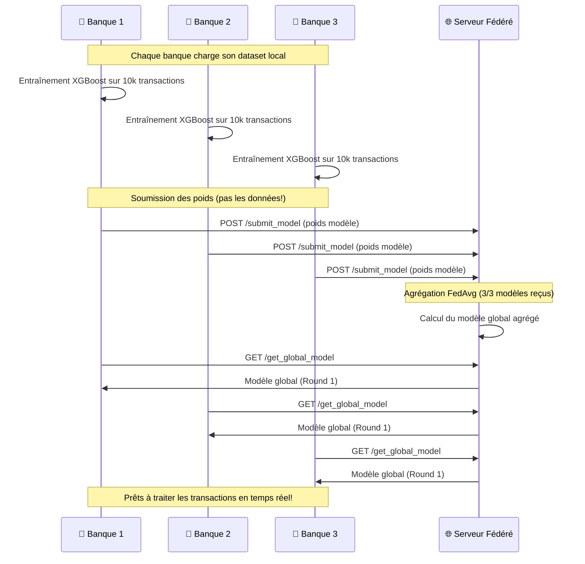
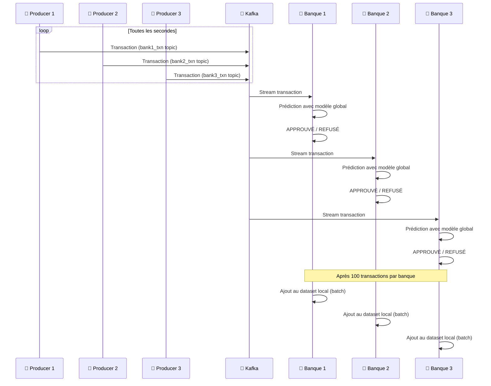
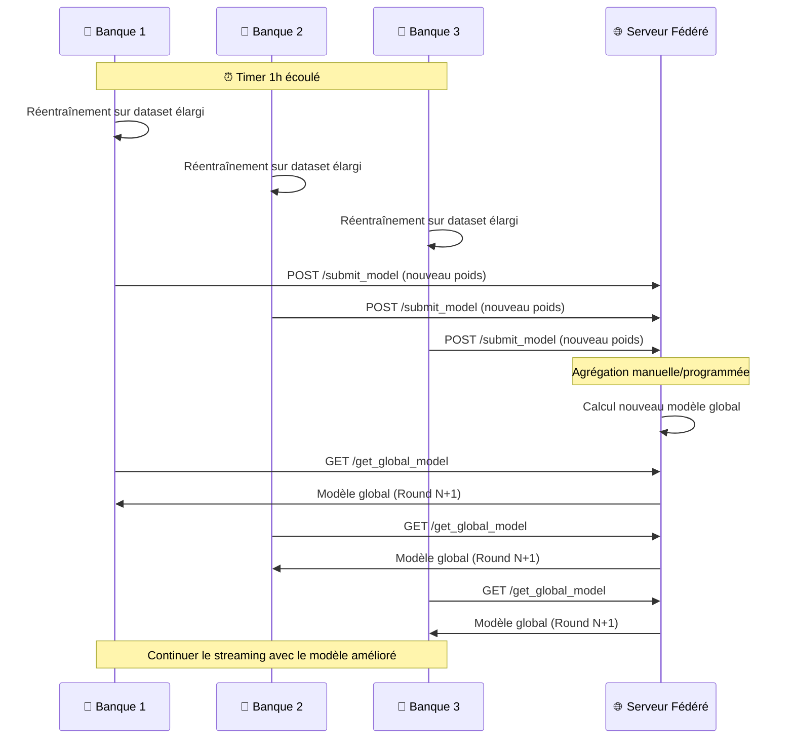

# 🏦 Système d'Approbation de Prêts par Apprentissage Fédéré

## 📋 Table des Matières
- [Vue d'ensemble](#-vue-densemble)
- [Architecture du Système](#-architecture-du-système)
- [Technologies Utilisées](#-technologies-utilisées)
- [Structure du Projet](#-structure-du-projet)
- [Préparation des Données](#-préparation-des-données)
- [Flux de Fonctionnement](#-flux-de-fonctionnement)
- [Installation et Démarrage](#-installation-et-démarrage)
- [Tableaux de Bord et Monitoring](#-tableaux-de-bord-et-monitoring)
- [Avantages du Système](#-avantages-du-système)

---

## 🎯 Vue d'ensemble

Ce projet implémente un **système d'apprentissage fédéré** pour l'approbation de prêts bancaires, permettant à trois banques de collaborer pour construire un modèle ML puissant tout en **préservant la confidentialité** de leurs données locales.

### Caractéristiques Principales

✅ **Confidentialité des Données** : Chaque banque conserve ses données localement  
✅ **Apprentissage Collaboratif** : Les banques partagent uniquement les poids du modèle, pas les données  
✅ **Traitement en Temps Réel** : Streaming de transactions via Apache Kafka  
✅ **Réentraînement Automatique** : Mise à jour du modèle toutes les heures  
✅ **Monitoring Complet** : Grafana + Prometheus pour la supervision système  
✅ **Visualisation Interactive** : Dashboard Streamlit pour les métriques ML  

### Dataset Utilisé

**Source** : [Loan Approval Classification Dataset](https://www.kaggle.com/datasets/taweilo/loan-approval-classification-data)

**Répartition** :
- 🏦 **Banque 1** : 10,000 transactions historiques
- 🏦 **Banque 2** : 10,000 transactions historiques  
- 🏦 **Banque 3** : 10,000 transactions historiques
- 📡 **Kafka (streaming)** : 15,000 transactions pour tests en temps réel

---

## 🏗️ Architecture du Système



---

## 🛠️ Technologies Utilisées

### Machine Learning
- **XGBoost** : Modèle de classification pour l'approbation de prêts
- **FedAvg** : Algorithme d'agrégation pour l'apprentissage fédéré
- **Scikit-learn** : Évaluation et métriques (AUC, F1, Precision, Recall)

### Backend & API
- **FastAPI** : Serveur fédéré pour l'agrégation des modèles
- **Python 3.9+** : Langage principal

### Streaming & Messagerie
- **Apache Kafka** : Streaming de transactions en temps réel
- **Zookeeper** : Coordination Kafka

### Monitoring & Visualisation
- **Streamlit** : Dashboard interactif pour les métriques ML
- **Grafana** : Visualisation des métriques système
- **Prometheus** : Collection de métriques et monitoring

### Conteneurisation
- **Docker** : Conteneurisation de tous les services
- **Docker Compose** : Orchestration multi-conteneurs

---

## 📁 Structure du Projet

```
federated-learning-loan-approval/
│
├── data/                               # Données bancaires partitionnées
│   ├── bank1/
│   │   └── bank1_dataset.csv          # 10k transactions (Banque 1)
│   ├── bank2/
│   │   └── bank2_dataset.csv          # 10k transactions (Banque 2)
│   ├── bank3/
│   │   └── bank3_dataset.csv          # 10k transactions (Banque 3)
│   └── kafka/
│       └── real_time_testing_dataset.csv  # 15k transactions (streaming)
│
├── server/
│   ├── federated_server.py            # Serveur FastAPI avec FedAvg
│   └── requirements.txt
│
├── clients/
│   ├── bank_client.py                 # Client bancaire (train + predict)
│   └── requirements.txt
│
├── kafka/
│   ├── producer.py                    # Producteur de transactions Kafka
│   └── requirements.txt
│
├── dashboards/
│   ├── streamlit_app.py               # Dashboard interactif Streamlit
│   ├── requirements.txt
│   └── .streamlit/
│       └── config.toml                
│
├── docker/
│   ├── Dockerfile.server              # Image serveur fédéré
│   ├── Dockerfile.client              # Image client bancaire
│   ├── Dockerfile.kafka               # Image producteur Kafka
│   └── Dockerfile.streamlit           # Image dashboard Streamlit
│
├── monitoring/
│   ├── prometheus.yml                 # Configuration Prometheus
│   ├── kafka.yml                      # Métriques JMX Kafka
│   └── jmx_prometheus_javaagent-1.5.0.jar  
│
├── models/                            # Créé automatiquement
│   ├── global/                        # Modèles globaux agrégés
│   └── local/                         # Modèles locaux par banque
│       ├── bank_1/
│       ├── bank_2/
│       └── bank_3/
│
├── logs/                              # Créé automatiquement
│   ├── server/                        # Logs du serveur fédéré
│   ├── bank1/                         # Logs + métriques Banque 1
│   ├── bank2/                         # Logs + métriques Banque 2
│   └── bank3/                         # Logs + métriques Banque 3
│
├── docker-compose.yml                 # Orchestration complète
├── models_testing.ipynb               # Analyse comparative des modèles
└── README.md                          # Ce fichier
```

---

## 📊 Préparation des Données

Le notebook `models_testing.ipynb` contient l'analyse préliminaire et la préparation des données :

### Contenu du Notebook
- **Exploration des données** : Analyse statistique et visualisations
- **Partitionnement** : Division du dataset en 4 chunks (3 pour les banques + 1 pour Kafka)
- **Comparaison de modèles** : Régression Logistique vs XGBoost
- **Sélection du modèle optimal** : XGBoost choisi pour ses performances supérieures
- **Évaluation des métriques** : AUC, F1-Score, Precision, Recall

> 📝 **Note** : Les datasets sont déjà préparés et inclus dans le dépôt. Le notebook est fourni uniquement à titre de référence pour comprendre le processus de préparation.

---

## 🔄 Flux de Fonctionnement

### Phase 1️⃣ : Entraînement Initial (Round 0)



### Phase 2️⃣ : Streaming et Prédictions en Temps Réel



### Phase 3️⃣ : Réentraînement Automatique (Toutes les heures)



---

## 🚀 Installation et Démarrage

### Prérequis

- **Docker** >= 20.10
- **Docker Compose** >= 2.0
- **Git**
- Au moins **8 GB RAM** disponible
- Au moins **10 GB** d'espace disque

### Installation

```bash
# 1. Cloner le dépôt
git clone https://github.com/chakorabdellatif/federated-learning-loan-approval.git
cd federated-learning-loan-approval

# 2. Vérifier la structure des données
ls data/bank1/bank1_dataset.csv
ls data/bank2/bank2_dataset.csv
ls data/bank3/bank3_dataset.csv
ls data/kafka/real_time_testing_dataset.csv

# 3. Démarrer tous les services
docker-compose up -d

# 4. Vérifier le statut des conteneurs
docker-compose ps
```

### Vérification du Démarrage

```bash
# Vérifier les logs du serveur fédéré
docker logs federated-server -f

# Vérifier les logs d'une banque
docker logs bank1-client -f

# Vérifier Kafka
docker logs kafka -f
```

### Ordre de Démarrage Automatique

1. **Zookeeper** → **Kafka** (coordination)
2. **Serveur Fédéré** (agrégation)
3. **Clients Bancaires** (entraînement initial → Round 0)
4. **Producteurs Kafka** (attendent la fin du Round 0)
5. **Streamlit & Grafana** (dashboards)

> ⏳ **Le démarrage complet prend ~2-3 minutes**

---

## 📊 Tableaux de Bord et Monitoring

### 1. Streamlit Dashboard (Port 8501)

Accès : [http://localhost:8501](http://localhost:8501)

#### 📈 Comparaison des Modèles


**Métriques affichées par banque** :
- **Accuracy** : Précision globale du modèle
- **AUC-ROC** : Aire sous la courbe ROC
- **F1-Score** : Moyenne harmonique de précision/rappel
- **Precision** : Taux de vrais positifs parmi les prédictions positives
- **Recall** : Taux de vrais positifs détectés
- **Nombre de prédictions**
- **Taux d'approbation/refus**

#### 🎬 Streaming Kafka en Temps Réel


**Informations affichées** :
- Volume de transactions par seconde
- Répartition par banque
- Statut des topics Kafka
- Latence du streaming
- Taux d'approbation en temps réel

---

### 2. Grafana (Port 3000)

Accès : [http://localhost:3000](http://localhost:3000)  
**Identifiants** : `admin` / `admin`

#### 📊 Dashboard 1 : Utilisation des Ressources


**Panels disponibles** :
- CPU usage par conteneur
- Mémoire RAM utilisée/disponible
- I/O Disque (lecture/écriture)
- Réseau (trafic entrant/sortant)
- Nombre de conteneurs actifs

---

#### 🌐 Dashboard 2 : Serveur Fédéré


**Panels disponibles** :
- Nombre de rounds d'entraînement
- Modèles reçus par round
- Temps d'agrégation
- Requêtes API par endpoint
- Nombre de clients enregistrés
- Modèles sauvegardés (global/local)

---

### 3. Prometheus (Port 9090)
Grafana's data source
Accès : [http://localhost:9090](http://localhost:9090)


---

## ✨ Avantages du Système

### 🔄 Persistance et Résilience

#### ✅ Redémarrage Intelligent
- **Les modèles sont sauvegardés sur disque** : Le serveur fédéré charge automatiquement le dernier modèle global
- **Pas de réentraînement depuis zéro** : Les banques téléchargent le modèle existant et reprennent le streaming
- **Continuité du service** : Arrêter/redémarrer l'application ne fait pas perdre les progrès

```bash
# Exemple : Redémarrer l'application
docker-compose down
docker-compose up -d

# ✅ Le système reprend au Round N (pas au Round 0!)
# ✅ Les datasets des banques contiennent toutes les transactions passées
# ✅ Le streaming Kafka continue normalement
```

#### 🗄️ Stockage Structuré
```
models/
├── global/
│   ├── latest.json          # ← Toujours le dernier modèle
│   ├── round_1.json
│   ├── round_2.json
│   └── round_N.json
└── local/
    ├── bank_1/
    │   ├── round_1.json
    │   └── round_N.json
    ├── bank_2/
    └── bank_3/
```

---

### 🔒 Confidentialité des Données

- **Les données restent locales** : Aucune banque ne voit les données d'une autre
- **Seuls les poids sont partagés** : Le serveur ne reçoit que les paramètres du modèle
- **Conformité réglementaire** : Respecte le RGPD et autres lois sur la protection des données

---

### 📈 Amélioration Continue

- **Apprentissage incrémental** : Le modèle s'améliore avec chaque round
- **Adaptation aux nouvelles données** : Réentraînement automatique toutes les heures
- **Bénéfice mutuel** : Toutes les banques profitent des données agrégées sans les partager

---

### ⚡ Performance

- **Traitement en temps réel** : Prédictions instantanées via Kafka streaming
- **Scalabilité** : Architecture conteneurisée facilement extensible
- **Monitoring complet** : Détection proactive des problèmes de performance

---

### 🛠️ Facilité d'utilisation

- **Déploiement en une commande** : `docker-compose up -d`
- **Dashboards intuitifs** : Streamlit + Grafana pour la visualisation
- **Configuration flexible** : Variables d'environnement ajustables
---
## 📚 Ressources Supplémentaires

- **Dataset Kaggle** : [Loan Approval Classification](https://www.kaggle.com/datasets/taweilo/loan-approval-classification-data)
- **XGBoost Documentation** : [https://xgboost.readthedocs.io](https://xgboost.readthedocs.io)
- **FastAPI Docs** : [https://fastapi.tiangolo.com](https://fastapi.tiangolo.com)
- **Apache Kafka Guide** : [https://kafka.apache.org/documentation](https://kafka.apache.org/documentation)
- **Federated Learning Paper** : [Communication-Efficient Learning (McMahan et al.)](https://arxiv.org/abs/1602.05629)

---

## 📧 Contact

Pour toute question ou suggestion, n'hésitez pas à ouvrir une issue sur GitHub.

---

**Développé avec ❤️ pour démontrer la puissance de l'apprentissage fédéré dans le secteur bancaire**
